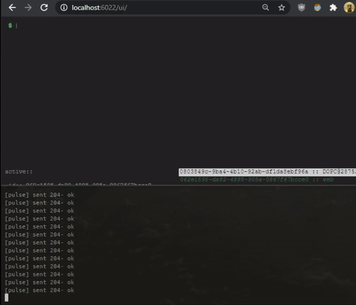

## r2ce - remote command execute with rust

provides remote command execution. learning project for rust, with nodejs and support for websocket. all for fun, not suitable for production use.



---

### local run

**server**

```bash
$ cd r2ce/server
$ npm i && npm start
```

**client**

```bash
$ cd r2ce/r2ce
$ cargo build && cargo run HOST:PORT
```


### todo
- refactor & code cleanup
- apply community coding standards
- improve ui
- improve socket payload
